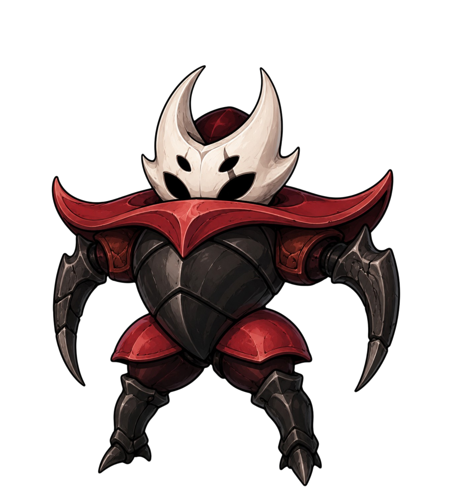

# ERYNDOR — Super Prompt + Análise Completa de Melhoria

> Documento gerado após leitura de: `index.html` (2777 linhas), `data.js` (5192 linhas), `js/main.js`, `js/canvas.js`, `js/characters.js`, `js/cursor.js`, `js/duel.js`, `js/loader.js`, `js/races.js`, `css/animations.css`, `css/components.css`, `css/layout.css`, `css/responsive.css`, `css/tokens.css`

---

## 1. DIAGNÓSTICO HONESTO DO ESTADO ATUAL

### O que está BOM e deve ser preservado

- **Palette de tokens** sólida: `--ink`, `--kore`, `--copper`, `--verdigris`, `--blood` — coerente com a fantasia sombria
- **Cursor customizado** com troca de cor por raça: ideia genial, rara em sites de worldbuilding
- **Parallax no banner de raça** via mousemove: execução limpa
- **Scroll-progress bar** no topo com gradiente tri-color: sofisticado
- **`clip-path` poligonal** nos botões (chanfrado) — estética de RPG sem clichê
- **Konami Code** adaptado (Kore Code) + Easter Egg do logo: personalidade
- **Canvas ambient** no hero: diferenciador visual
- **Sistema modular** de JS em arquivos separados por responsabilidade

### O que está FRACO e precisa ser destruído/refeito

| Problema                                                                    | Onde           | Impacto                                    |
| --------------------------------------------------------------------------- | -------------- | ------------------------------------------ |
| Lore de 30+ personagens com texto genérico ("presença recém-reconhecida")   | `data.js`      | Quebra toda a imersão                      |
| `font-size: 6.1rem` no hero title não tem responsividade real via `clamp()` | CSS hero       | Quebra em tablet 768px                     |
| Seção Crônica ("O mapa não fica parado") é apenas texto estático            | `index.html`   | Desperdício da proposta de "atlas vivo"    |
| Banners de raça: um `` com parallax básico                             | `js/races.js`  | Sem profundidade, sem história visual      |
| Filtro de personagens: dropdown simples + input texto                       | CSS/JS         | Não reflete a lógica de "atlas de guerra"  |
| Mesa de Duelo: dois cards lado a lado sem tensão dramática                  | `js/duel.js`   | Mecânica pouco envolvente                  |
| Loader: sigil giratório + barra de progresso genérica                       | `js/loader.js` | Momento de entrada perdido                 |
| `data.js` com personagens sem lore real (Pyre, Scylla, Valerius, Zoro…)     | `data.js`      | 30% do conteúdo é placeholder              |
| Mapa (`rift-map`) é puro CSS com hex clip-path                              | `index.html`   | Promete mapa interativo, entrega decoração |
| Nenhum estado de transição entre seções                                     | CSS            | Rolagem abrupta, sem fluxo narrativo       |

---

## 2. SUPER PROMPT — USE ESTE PARA CADA IMPLEMENTAÇÃO

```
Você é o arquiteto de experiências do ERYNDOR — um worldbuilding de fantasia sombria onde:
- Cristais Kore fragmentaram a ordem entre planos
- 10+ raças (Amaldiçoados, Aparições, Beserk, Canibais, Demônios…) disputam território
- O site É o atlas: cada interação revela camadas da Convergência

CONTEXTO TÉCNICO:
- Stack: HTML puro + CSS com custom properties + JS vanilla modular
- Hosted em GitHub Pages (sem backend, sem npm, sem build step)
- Fontes: Cinzel Decorative (display), Cinzel (subheadings), EB Garamond (corpo), Bricolage Grotesque (UI)
- Tokens existentes: --ink, --kore, --copper, --verdigris, --blood, --bone, --paper, --muted

PRINCÍPIOS DE DESIGN INEGOCIÁVEIS:
1. Cada animação conta um pedaço da história — se não tem lore, não existe
2. O usuário deve sentir que está DENTRO do atlas, não olhando para ele
3. Nenhuma transição genérica: cada hover, scroll e click deve ter significado dramático
4. Performance first: CSS transitions antes de JS, requestAnimationFrame onde necessário
5. Acessibilidade: prefers-reduced-motion sempre respeitado

HIERARQUIA DE IMPACTO (priorize nesta ordem):
- Imersão narrativa > Beleza visual > Funcionalidade técnica > Originalidade de código

PROIBIÇÕES ABSOLUTAS:
- Sem gradientes pastéis ou palettes "premium dark"
- Sem card grids padronizados sem textura
- Sem animações de "loading spinner" genéricas
- Sem typography system copiado de Tailwind ou Bootstrap
- Sem glassmorphism básico (blur sem propósito)
- Sem lore placeholder — cada personagem precisa de história real

AO IMPLEMENTAR QUALQUER FEATURE, responda sempre:
1. Qual momento da história do Eryndor isso representa?
2. Que técnica CSS/JS vai causar "wow" num dev senior?
3. Como isso funciona sem JavaScript (fallback gracioso)?
```

---

## 3. ROADMAP DE MELHORIAS — PRIORIDADE MÁXIMA PRIMEIRO

---

### 🔴 PRIORIDADE 1 — IMERSÃO NARRATIVA (faz o site ter alma)

#### 3.1 Loader como Ritual de Entrada

**O que mudar:** O loader atual é sigil girando + barra. Deveria ser o momento em que o usuário "atravessa o Selo".

**Implementação:**

```css
/* Loader redesenhado: fragmentação de selos */
.site-loader {
  background: radial-gradient(ellipse at center, #1a0a00 0%, #080706 70%);
}

/* Partículas de cristal Kore emanando do centro */
.loader-kore-shards {
  position: absolute;
  inset: 0;
  /* SVG animado com fragmentos de cristal */
}

/* Texto que "rasga" a barreira */
.loader-text {
  animation: sealRip 0.8s cubic-bezier(0.25, 1.5, 0.5, 1) both;
  letter-spacing: 0.4em;
}

@keyframes sealRip {
  from {
    clip-path: inset(50% 0 50% 0);
    filter: brightness(3) blur(4px);
  }
  to {
    clip-path: inset(0 0 0 0);
    filter: brightness(1) blur(0);
  }
}
```

**Narrativa:** "Os Selos cedem. Você está entrando em Eryndor."
**Duração ideal:** 1.8s máximo — cinematográfico, não cansativo.

---

#### 3.2 Hero — Do Banner Estático para o Campo de Batalha

**O que mudar:** O hero atual tem canvas ambient + parallax no background. Falta a sensação de que a guerra está acontecendo AGORA.

**Técnica: Compositing por camadas com scroll-driven animation (CSS nativa)**

```css
/* Adicionar ao CSS do hero */
@keyframes scroll-hero {
  to {
    transform: translateY(-40px);
  }
}

.hero::before {
  animation: scroll-hero linear both;
  animation-timeline: scroll(root);
  animation-range: 0 400px;
}

/* Névoa de batalha que emerge com scroll */
.hero-warfog {
  position: absolute;
  inset: 0;
  background:
    radial-gradient(
      ellipse 120% 60% at 30% 80%,
      rgba(184, 61, 52, 0.18),
      transparent
    ),
    radial-gradient(
      ellipse 80% 40% at 70% 20%,
      rgba(74, 181, 158, 0.12),
      transparent
    );
  animation: fogDrift 8s ease-in-out infinite alternate;
}

@keyframes fogDrift {
  from {
    transform: translateX(-1%) scale(1.02);
    opacity: 0.6;
  }
  to {
    transform: translateX(1%) scale(0.98);
    opacity: 1;
  }
}
```

**Adicionar ao canvas.js:** Partículas de Kore flutuando que reagem ao movimento do mouse — cada raça tem sua cor de partícula quando o cursor está sobre o dossier dela.

---

#### 3.3 Seção Crônica — O Atlas que Respira

**Problema central:** "O mapa não fica parado" mas o mapa é CSS estático.

**Solução: SVG Map progressivo com scroll-triggered lore reveals**

O `rift-map` deve ser um SVG real com:

- Regiões clicáveis (Korrfeld, Wildmere, Sombrath, Thornwall, Plano Espiritual)
- Pulsação de cores baseada nas raças nativas de cada região
- Ao scroll chegar no capítulo correspondente, a região no mapa "acende"

```javascript
// js/map.js (novo arquivo)
class EryndorMap {
  constructor(svgEl) {
    this.regions = {
      korrfeld: { color: "#c0392b", races: ["amaldic"] },
      wildmere: { color: "#d35400", races: ["beserk"] },
      sombrath: { color: "#8e44ad", races: ["demonio"] },
      thornwall: { color: "#2ecc71", races: ["elfo", "semideus"] },
      spiritual: { color: "#8ab4c0", races: ["aparic"] },
    };
  }

  pulseRegion(regionId, intensity = 1) {
    const el = this.svgEl.querySelector(`[data-region="${regionId}"]`);
    el?.animate(
      [
        { filter: "brightness(1)", opacity: 0.6 },
        { filter: `brightness(${1 + intensity})`, opacity: 1 },
        { filter: "brightness(1)", opacity: 0.6 },
      ],
      { duration: 2000, iterations: Infinity, easing: "ease-in-out" },
    );
  }
}
```

---

### 🟠 PRIORIDADE 2 — DESIGN VISUAL (200% melhor)

#### 3.4 Banners de Raça — De Imagem para Território

**Problema:** O banner atual é uma `` com parallax básico. Sem profundidade, sem identidade da raça.

**Solução: Multi-layer composition com CSS backdrop + SVG sigil único por raça**

```css
/* Cada raça tem um padrão de fundo único além da imagem */
.race-stage[data-race="amaldic"] {
  --race-pattern: url("data:image/svg+xml,<svg>…crânios geométricos…</svg>");
}

.race-stage[data-race="beserk"] {
  --race-pattern: url("data:image/svg+xml,<svg>…runas nórdicas…</svg>");
}

/* Layer stack: pattern + noise + banner + vignette + overlay de cor */
.race-stage::before {
  background:
    /* 1. Vignette dramático */
    radial-gradient(
      ellipse at 80% 50%,
      transparent 40%,
      rgba(8, 7, 6, 0.95) 100%
    ),
    /* 2. Overlay de cor da raça */
    linear-gradient(
        125deg,
        color-mix(in srgb, var(--active-race), transparent 82%),
        transparent 55%
      ),
    /* 3. Pattern único */ var(--race-pattern),
    /* 4. Banner */ var(--race-bg) center/cover no-repeat;
}
```

**Transition ao trocar raça:** Não fade simples. Implementar `clip-path` transition:

```css
.race-banner {
  clip-path: polygon(0 0, 100% 0, 100% 100%, 0 100%);
  transition: clip-path 0.65s cubic-bezier(0.76, 0, 0.24, 1);
}

.race-banner.is-leaving {
  clip-path: polygon(100% 0, 100% 0, 100% 100%, 100% 100%);
}

.race-banner.is-entering {
  clip-path: polygon(0 0, 100% 0, 100% 100%, 0 100%);
}
```

---

#### 3.5 Cards de Personagem — Dossiê Real, Não Grid de Avatar

**Problema:** Os cards de personagem são avatar + nome + badge. Parecem cards de jogo de baralho sem alma.

**Solução: Cards com estrutura de dossiê/prontuário de guerra**

```html
<!-- Estrutura nova do card -->
<article class="char-dossier" style="--race-color: …; --threat: 87">
  <header class="dossier-header">
    <span class="dossier-id">REG-0042</span>
    <span class="dossier-align" data-align="evil">⚠ HOSTIL</span>
  </header>

  <div class="dossier-portrait">
    
    <!-- Threat meter como border animado -->
    <div class="threat-ring" style="--pct: calc(var(--threat) * 3.6deg)"></div>
  </div>

  <div class="dossier-body">
    <p class="dossier-race">Amaldiçoados · Korrfeld</p>
    <h3 class="dossier-name">Crimson Kore</h3>
    <p class="dossier-title">O Primeiro Amaldiçoado</p>
  </div>

  <div class="dossier-stats-mini">
    <!-- Barras horizontais de POW/SPD/DEF/INT -->
  </div>

  <footer class="dossier-footer">
    <span class="dossier-status" data-status="Ativo">● ATIVO</span>
    <button class="dossier-open">Dossiê Completo →</button>
  </footer>
</article>
```

```css
/* Threat ring via conic-gradient */
.threat-ring {
  position: absolute;
  inset: -4px;
  border-radius: 50%;
  background: conic-gradient(
    var(--race-color) var(--pct),
    rgba(255, 255, 255, 0.06) var(--pct)
  );
  mask: radial-gradient(circle, transparent 82%, black 83%);
}
```

---

#### 3.6 Sistema Tipográfico Elevado

**Problema:** Fonts estão bem escolhidas mas usadas de forma previsível.

**Técnicas a adicionar:**

```css
/* 1. Títulos com text-stroke para profundidade */
.race-stage-copy h3 {
  -webkit-text-stroke: 1px
    color-mix(in srgb, var(--active-race), transparent 60%);
  paint-order: stroke fill;
}

/* 2. Hero H1 com scramble letter reveal */
.hero-letter {
  display: inline-block;
  animation: letterReveal 0.6s cubic-bezier(0.22, 1, 0.36, 1) both;
  animation-delay: calc(var(--i) * 0.05s);
}

/* 3. Lore text com ornamentos */
.modal-lore::first-letter {
  float: left;
  font-size: 3.5em;
  line-height: 0.75;
  margin: 0.1em 0.1em 0 0;
  color: var(--active-race);
  font-family: "Cinzel Decorative", serif;
}

/* 4. Section eyebrows com contador de raças */
.section-eyebrow[data-count]::after {
  content: " — " counter(race-count) " linhagens registradas";
  color: var(--muted);
  font-size: 0.75em;
}
```

---

#### 3.7 Mesa de Duelo — Tensão Dramática Real

**Problema:** Dois cards lado a lado com "VS" no meio. Sem build-up, sem teatro.

**Solução: Duelo como cena de combate**

```javascript
// Sequência de entrada dramatizada
async function dramaticDuelReveal(left, right, els) {
  // 1. Escurecer tela (2/3 para o preto)
  els.duelArena.classList.add("pre-combat");
  await wait(400);

  // 2. Rugido sonoro via Web Audio API (opcional, com toggle de som)
  playKoreChime();

  // 3. Rachar a tela ao meio com clip-path animation
  els.duelLeft.style.clipPath = "polygon(0 0, 100% 0, 100% 100%, 0 100%)";
  els.duelLeft.animate(
    [
      { clipPath: "polygon(0 0, 0 0, 0 100%, 0 100%)" },
      { clipPath: "polygon(0 0, 100% 0, 100% 100%, 0 100%)" },
    ],
    {
      duration: 500,
      easing: "cubic-bezier(0.22, 1, 0.36, 1)",
      fill: "forwards",
    },
  );

  await wait(200);

  // 4. Right entra pelo lado oposto
  els.duelRight.animate(
    [
      { clipPath: "polygon(100% 0, 100% 0, 100% 100%, 100% 100%)" },
      { clipPath: "polygon(0 0, 100% 0, 100% 100%, 0 100%)" },
    ],
    {
      duration: 500,
      easing: "cubic-bezier(0.22, 1, 0.36, 1)",
      fill: "forwards",
    },
  );

  await wait(600);

  // 5. Raio de impacto no centro (CSS ::after com glow burst)
  els.duelArena.classList.add("impact");

  await wait(300);

  // 6. Veredicto aparece com typewriter
  typewriteVerdict(els.duelVerdict, calcVerdict(left, right));
}
```

```css
/* Arena de duelo */
.duel-arena {
  position: relative;
  display: grid;
  grid-template-columns: 1fr 6px 1fr;
  gap: 0;
  min-height: 500px;
  overflow: hidden;
  background: radial-gradient(ellipse at center, #180a00, #080706);
}

/* Linha de racha central com glow */
.duel-rift {
  width: 6px;
  background: linear-gradient(180deg, transparent, var(--kore), transparent);
  box-shadow:
    0 0 40px var(--kore),
    0 0 80px rgba(215, 175, 69, 0.3);
  animation: riftPulse 2s ease-in-out infinite;
}

/* Impacto de Kore no momento do duelo */
.duel-arena.impact::after {
  content: "";
  position: absolute;
  inset: 0;
  background: radial-gradient(
    ellipse at center,
    rgba(215, 175, 69, 0.6),
    transparent 50%
  );
  animation: koreImpact 0.4s ease-out forwards;
}

@keyframes koreImpact {
  0% {
    opacity: 1;
    transform: scale(0.3);
  }
  100% {
    opacity: 0;
    transform: scale(3);
  }
}
```

---

#### 3.8 Modal de Personagem — A Ficha que Vive

**Melhoria:** O modal atual tem stats e lore. Precisa de mais camadas sensoriais.

```css
/* Modal com ruído de pergaminho + borda viva */
.character-modal {
  background:
    /* Ruído de papel pergaminho */
    url("data:image/svg+xml,<svg xmlns='http://www.w3.org/2000/svg' width='200' height='200'><filter id='noise'><feTurbulence type='fractalNoise' baseFrequency='0.9' numOctaves='4'/><feColorMatrix type='saturate' values='0'/></filter><rect width='200' height='200' filter='url(%23noise)' opacity='0.03'/></svg>"),
    linear-gradient(160deg, rgba(8, 7, 6, 0.98), rgba(20, 15, 8, 0.99));
  border: 1px solid color-mix(in srgb, var(--active-race), transparent 40%);
}

/* Barra de ameaça animada como plasma */
.stat-bar-fill {
  background: linear-gradient(
    90deg,
    var(--race-color),
    color-mix(in srgb, var(--race-color), #fff 30%)
  );
  box-shadow: 0 0 12px var(--race-color);
  animation: plasmaFlow 3s ease-in-out infinite alternate;
}

@keyframes plasmaFlow {
  from {
    filter: brightness(1);
  }
  to {
    filter: brightness(1.4);
  }
}
```

---

### 🟡 PRIORIDADE 3 — FUNCIONALIDADE ELEVADA

#### 3.9 Lore dos Personagens — Completar os Placeholders

Os personagens abaixo têm lore genérico e precisam de texto real:

**Amaldiçoados:** Pyre, Scylla, Valerius, Zoro
**Aparições:** Kaminari, Mycelium  
**Beserk:** Grom, Ksante (duplicado!), Thomas, Thorin, Thrum, Zephyrus

**Técnica para gerar lore coerente:** Use o Super Prompt acima + este sub-prompt:

```
Para o personagem [NOME] da raça [RAÇA] de Eryndor:
- Ele/ela chegou ao mundo ANTES ou DEPOIS da Grande Fratura?
- Qual foi seu PRIMEIRO contato com energia Kore?
- Qual é a FERIDA que carrega (física, emocional, filosófica)?
- Qual é a PROMESSA que o mantém vivo (mesmo que impossível)?
- Qual REGIÃO marcou seu corpo/alma?
- Escreva o lore em 3-4 frases no estilo: épico, econômico, sem adjetivos genéricos.

Proibido usar: "poderoso", "lendário", "temido", "renomado", "brilhante"
```

---

#### 3.10 Filtros de Personagens — Atlas de Guerra, Não E-commerce

**Problema:** Input de busca + dropdown = lógica de loja. Não faz sentido num atlas de batalha.

**Solução: Tags de "inteligência de campo"**

```html
<!-- Substituir filtros atuais por -->
<div class="intel-filters">
  <div class="intel-group">
    <span class="intel-label">⚔ Alinhamento</span>
    <div class="intel-tags">
      <button class="intel-tag" data-filter="align:good">Aliado</button>
      <button class="intel-tag" data-filter="align:neutral">Neutro</button>
      <button class="intel-tag" data-filter="align:evil">Hostil</button>
      <button class="intel-tag" data-filter="align:chaos">Imprevisível</button>
    </div>
  </div>

  <div class="intel-group">
    <span class="intel-label">⚠ Nível de Ameaça</span>
    <div class="intel-tags">
      <button class="intel-tag" data-filter="threat:critical">
        Crítico 90+
      </button>
      <button class="intel-tag" data-filter="threat:high">Alto 70-89</button>
      <button class="intel-tag" data-filter="threat:medium">Médio -69</button>
    </div>
  </div>

  <div class="intel-group">
    <span class="intel-label">📍 Status</span>
    <div class="intel-tags">
      <button class="intel-tag" data-filter="status:Ativo">Ativo</button>
      <button class="intel-tag" data-filter="status:Errante">Errante</button>
      <button class="intel-tag" data-filter="status:Fragmentado">
        Fragmentado
      </button>
    </div>
  </div>
</div>
```

---

#### 3.11 Scroll Storytelling — Seções que Respiram

**Técnica: Horizontal scroll dentro de seção vertical (sem wheel hijack)**

```css
/* Crônica como timeline horizontal com scroll snap */
.chronicle-scroll {
  display: flex;
  gap: 2rem;
  overflow-x: auto;
  scroll-snap-type: x mandatory;
  -webkit-overflow-scrolling: touch;
  padding-bottom: 1rem;
  scrollbar-width: none;
}

.chronicle-scroll::-webkit-scrollbar {
  display: none;
}

.chronicle-chapter {
  flex: 0 0 min(80vw, 600px);
  scroll-snap-align: center;
  position: relative;
}

/* Linha do tempo conectando os capítulos */
.chronicle-scroll::before {
  content: "";
  position: absolute;
  left: 0;
  right: 0;
  top: 50%;
  height: 2px;
  background: linear-gradient(
    90deg,
    transparent,
    var(--kore),
    var(--verdigris),
    transparent
  );
  pointer-events: none;
}
```

---

### 🟢 PRIORIDADE 4 — TÉCNICAS QUE IMPRESSIONAM DEVS

#### 3.12 Cursor que Conta a História

O cursor atual troca de cor por raça (ótimo). **Elevar:**

```javascript
// cursor.js — adicionar estado de "batalha"
class EryNdorCursor {
  setState(state) {
    // 'explore' → cursor padrão com ring lento
    // 'combat' → cursor com aura pulsante rápida (hover em cards de duelo)
    // 'ancient' → cursor com trail de fragmentos Kore (hover em Amaldiçoados)
    // 'spectral' → cursor semi-transparente (hover em Aparições)
    this.el.dataset.state = state;
  }

  // Trail de partículas ao mover sobre personagens de alta ameaça
  addKoreTrail(x, y, raceColor) {
    const particle = document.createElement("div");
    particle.className = "cursor-kore-particle";
    particle.style.cssText = `
      left: ${x}px; top: ${y}px;
      background: ${raceColor};
      animation: particleFade 0.6s ease-out forwards;
    `;
    document.body.appendChild(particle);
    setTimeout(() => particle.remove(), 600);
  }
}
```

---

#### 3.13 CSS Scroll-Driven Animations (sem JavaScript)

**Técnica nativa moderna que impressiona devs:**

```css
/* Barras de stats no modal que crescem quando o modal abre */
@keyframes stat-fill {
  from {
    width: 0%;
  }
  to {
    width: var(--stat-pct);
  }
}

.stat-bar-fill {
  animation: stat-fill 1s cubic-bezier(0.22, 1, 0.36, 1) both;
  animation-delay: calc(var(--stat-index) * 0.1s);
  /* Dispara ao abrir o modal via animation-play-state */
  animation-play-state: paused;
}

.modal.is-open .stat-bar-fill {
  animation-play-state: running;
}

/* View Transitions API ao navegar entre raças */
/* (quando suportado) */
@view-transition {
  navigation: auto;
}

.race-stage::view-transition-old {
  animation: slideOutLeft 0.4s ease-in;
}

.race-stage::view-transition-new {
  animation: slideInRight 0.4s ease-out;
}
```

---

#### 3.14 Web Audio API — Atmosfera Sonora (opcional, com toggle)

```javascript
// js/audio.js (novo, carregado por demanda)
class KoreAmbience {
  constructor() {
    this.ctx = null; // Lazy init após primeiro gesto do usuário
    this.enabled = false;
  }

  init() {
    if (this.ctx) return;
    this.ctx = new AudioContext();
    this.createDroneOscillator(); // Tom base sinistro de Eryndor
  }

  createDroneOscillator() {
    const osc = this.ctx.createOscillator();
    const gain = this.ctx.createGain();
    const filter = this.ctx.createBiquadFilter();

    osc.frequency.value = 55; // A1 — grave e ominoso
    filter.type = "lowpass";
    filter.frequency.value = 200;
    gain.gain.value = 0.03; // Quase inaudível, ambiental

    osc.connect(filter);
    filter.connect(gain);
    gain.connect(this.ctx.destination);
    osc.start();
  }

  // Chime de Kore ao abrir modal de personagem de ameaça alta
  playKoreChime(threatLevel) {
    const freq = 200 + threatLevel * 8; // Mais alto = mais agudo
    // ... implementação
  }
}
```

---

#### 3.15 `@property` CSS para Animações de Gradiente

```css
/* Técnica rara: animar gradientes via custom property tipada */
@property --kore-angle {
  syntax: "<angle>";
  inherits: false;
  initial-value: 45deg;
}

@property --race-glow-opacity {
  syntax: "<number>";
  inherits: false;
  initial-value: 0.3;
}

.race-card.is-active {
  --kore-angle: 225deg;
  transition:
    --kore-angle 0.8s ease,
    --race-glow-opacity 0.4s ease;
  background: linear-gradient(
    var(--kore-angle),
    var(--race-color),
    transparent
  );
}
```

---

## 4. CHECKLIST DE REMOÇÃO — O QUE TIRAR AGORA

- [ ] Todas as instâncias de lore `"presença recém-reconhecida em Eryndor"` — substituir por texto real
- [ ] `Personagem de [Raça]` no campo `role` — sem significado narrativo
- [ ] O sigil do loader (forma de estrela giratória) — muito genérico, substituir por símbolo único de Eryndor
- [ ] Hover effects de translateY(-3px) em todos os botões — muito padrão, diferentizar por tipo
- [ ] A seção "Mesa de Duelo" com apenas "Aguardando o próximo choque" como estado vazio — usar lore real
- [ ] Ksante duplicado em Beserk (existe tanto como personagem completo quanto como placeholder)
- [ ] O gradiente `linear-gradient(135deg, #f0d98b, var(--kore) 48%, #b86838)` no `.command-button` — muito "botão premium de SaaS"

---

## 5. ORÇAMENTO DE IMPACTO — MENOR ESFORÇO, MAIOR WOW

| Implementação                       | Esforço (dias) | Impacto Visual | Impacto Dev |
| ----------------------------------- | -------------- | -------------- | ----------- |
| Duelo cinematográfico com clip-path | 1              | ★★★★★          | ★★★★☆       |
| Cards de dossiê com threat ring     | 1              | ★★★★★          | ★★★★☆       |
| Loader como ritual de Selos         | 0.5            | ★★★★☆          | ★★★☆☆       |
| @property CSS para gradientes       | 0.5            | ★★★☆☆          | ★★★★★       |
| Cursor com estados e trail          | 1              | ★★★★☆          | ★★★★★       |
| SVG Map interativo                  | 3              | ★★★★★          | ★★★★★       |
| Lore completo dos placeholders      | 2              | ★★★★★          | ★☆☆☆☆       |
| Filtros de inteligência de campo    | 1              | ★★★☆☆          | ★★★☆☆       |
| Scroll timeline horizontal          | 1              | ★★★★☆          | ★★★☆☆       |
| Web Audio ambiental                 | 2              | ★★★★☆          | ★★★★★       |

---

## 6. EXEMPLO DE IMPLEMENTAÇÃO COMPLETA — Card de Dossiê

```html
<!-- Substitui o .char-card atual -->
<article
  class="dossier-card reveal"
  data-race="amaldic"
  data-threat="95"
  style="--race-color: #c0392b; --threat-pct: 95%"
  tabindex="0"
  role="button"
  aria-label="Abrir dossiê de Crimson Kore"
>
  <!-- Header de classificação -->
  <div class="dossier-class">
    <code class="dossier-id">REG-AMLD-001</code>
    <span class="dossier-align is-evil">⚠ HOSTIL</span>
  </div>

  <!-- Retrato com ring de ameaça -->
  <div class="dossier-portrait-wrap">
    <div class="threat-ring" aria-hidden="true"></div>
    
    <div class="dossier-region-badge">Korrfeld</div>
  </div>

  <!-- Identidade -->
  <div class="dossier-identity">
    <p class="dossier-lineage">Amaldiçoados</p>
    <h3 class="dossier-name">Crimson Kore</h3>
    <p class="dossier-epithet">O Primeiro Amaldiçoado</p>
  </div>

  <!-- Stats compactos -->
  <div class="dossier-stats" aria-label="Estatísticas de combate">
    <div class="stat-mini" style="--v: 95%">
      <span>POW</span>
      <div class="bar"><div></div></div>
    </div>
    <div class="stat-mini" style="--v: 80%">
      <span>VEL</span>
      <div class="bar"><div></div></div>
    </div>
    <div class="stat-mini" style="--v: 88%">
      <span>DEF</span>
      <div class="bar"><div></div></div>
    </div>
  </div>

  <!-- Footer de status -->
  <footer class="dossier-footer">
    <span class="dossier-status is-active">● Ativo</span>
    <span class="dossier-cta">Abrir dossiê ›</span>
  </footer>
</article>
```

```css
.dossier-card {
  position: relative;
  background:
    repeating-linear-gradient(
      135deg,
      rgba(240, 226, 196, 0.025) 0 1px,
      transparent 1px 12px
    ),
    linear-gradient(
      160deg,
      color-mix(in srgb, var(--race-color), #0a0806 88%),
      rgba(8, 7, 6, 0.96)
    );
  border: 1px solid color-mix(in srgb, var(--race-color), transparent 55%);
  clip-path: polygon(
    0 0,
    calc(100% - 18px) 0,
    100% 18px,
    100% 100%,
    18px 100%,
    0 calc(100% - 18px)
  );
  cursor: pointer;
  transition:
    transform 0.35s cubic-bezier(0.22, 1, 0.36, 1),
    border-color 0.25s ease,
    box-shadow 0.35s ease;
}

.dossier-card:hover,
.dossier-card:focus-visible {
  transform: translateY(-6px) scale(1.015);
  border-color: color-mix(in srgb, var(--race-color), #fff 28%);
  box-shadow:
    0 24px 60px rgba(0, 0, 0, 0.5),
    0 0 0 1px var(--race-color);
  outline: none;
}

/* Threat ring via conic-gradient */
.threat-ring {
  position: absolute;
  inset: -6px;
  border-radius: 50%;
  background: conic-gradient(
    var(--race-color) var(--threat-pct),
    rgba(255, 255, 255, 0.05) var(--threat-pct)
  );
  mask: radial-gradient(circle, transparent 78%, black 79%);
  transition: opacity 0.3s ease;
  opacity: 0;
}

.dossier-card:hover .threat-ring {
  opacity: 1;
}

/* Stat bars animadas */
.stat-mini .bar div {
  height: 3px;
  width: var(--v);
  background: linear-gradient(
    90deg,
    var(--race-color),
    color-mix(in srgb, var(--race-color), #fff 40%)
  );
  transform: scaleX(0);
  transform-origin: left;
  transition: transform 0.6s cubic-bezier(0.22, 1, 0.36, 1);
  transition-delay: calc(var(--stat-index, 0) * 0.08s);
}

.dossier-card:hover .stat-mini .bar div,
.dossier-card:focus-visible .stat-mini .bar div {
  transform: scaleX(1);
}
```

---

## 7. PALAVRAS FINAIS — O QUE FAZ UM SITE SER GENIAL

O ERYNDOR já tem a estrutura certa. A alma existe no código: cursor que muda com raça, canvas ambient, scroll-ratio no topo, easter eggs, parallax de banner. **O que está faltando é coerência dramática** — cada peça funciona isolada, mas o conjunto ainda não conta uma história única.

O salto de "bom" para "genial" acontece quando:

1. **O usuário não consegue descrever a técnica**, só a emoção ("parece que o atlas está vivo")
2. **Um dev abre o DevTools por curiosidade** ("como eles fizeram isso com CSS puro?")
3. **Cada personagem tem peso**, não é ficha de dado — tem ferida, tem promessa, tem destino
4. **O scroll é narrativo**: você desce a página como quem avança numa guerra

Use este documento como bússola. Implemente uma prioridade por vez, teste no mobile, commit, repita.

**Eryndor respira em guerra. Faça o código respirar com ela.**
